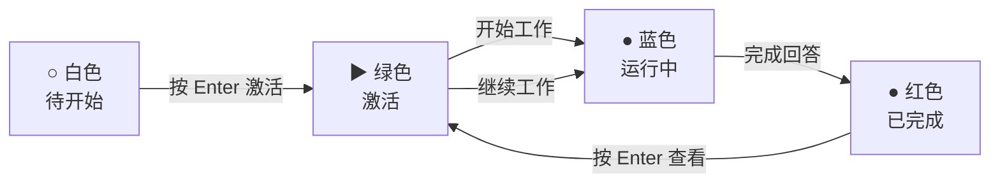

# 任务状态颜色方案

## 视觉参考

```
┌─────────────────────────────┐
│  TASKS                      │
│ ─────────────────────────── │
│ ▶ 数据分析         (绿色)   │  ← 当前激活的任务
│ ● 模型训练         (蓝色)   │  ← Claude 正在工作
│ ● 代码重构         (红色)   │  ← 已完成，等待查看
│ ○ 文档整理         (白色)   │  ← 待开始
└─────────────────────────────┘
```

## 颜色含义

### 🟢 绿色箭头 ▶ - 激活状态
- **含义**：当前选中/激活的任务
- **触发**：按 `Enter` 激活任务，或使用 `1-5` 快捷键
- **行为**：右侧 tmux 切换到对应的 session

### 🔵 蓝色圆点 ● - 运行中
- **含义**：Claude 正在处理任务，生成回答中
- **触发**：
  - 新建任务后自动进入此状态
  - 激活一个已完成的任务时重置为此状态
- **特征**：右侧可以看到 "Meandering..." 或其他思考中的提示

### 🔴 红色圆点 ● - 已完成
- **含义**：Claude 已完成回答，等待用户查看
- **触发**：
  - 自动检测：每 5 秒检测一次，发现 Claude 提示符时自动标记
  - 手动刷新：按 `r` 键立即检测
- **特征**：右侧显示 Claude 的提示符（❯ 或 > ）
- **操作**：按 `Enter` 激活任务查看内容，状态自动重置为运行中

### ⚪ 白色圆圈 ○ - 其他状态
- **含义**：待开始、失败或其他未激活状态
- **特征**：任务还未开始工作

## 状态转换流程



## 快捷操作

| 操作 | 快捷键 | 效果 |
|------|--------|------|
| 激活任务 | `Enter` | 切换到该任务，标记为绿色 ▶ |
| 刷新状态 | `r` | 立即检测所有任务状态 |
| 新建任务 | `n` | 创建新任务，自动标记为蓝色 ● |
| 上/下选择 | `j`/`k` 或 `↑`/`↓` | 移动选择 |
| 快速切换 | `1-5` | 直接激活第 1-5 个任务 |

## 注意事项

1. **自动检测间隔**：默认 5 秒，可以按 `r` 手动刷新
2. **提示符检测**：检测 Claude 的提示符（`❯`, `>`, `? for shortcuts`）
3. **状态持久化**：任务状态保存在 `~/.local/share/claude-manager/data/tasks.json`

## 调整建议

### 修改检测间隔
如果觉得 5 秒太慢，编辑 `app.py:170` 行：
```python
self.set_interval(5, self.check_task_status_async)  # 改为 2-3 秒
```

### 添加自定义提示符
如果你的 Claude 使用不同的提示符，编辑 `app.py:228-232` 行：
```python
prompt_indicators = [
    '❯',
    '> ',
    '? for shortcuts',
    'your_custom_prompt',  # 添加你的提示符
]
```

---

**创建日期**: 2026-02-03
